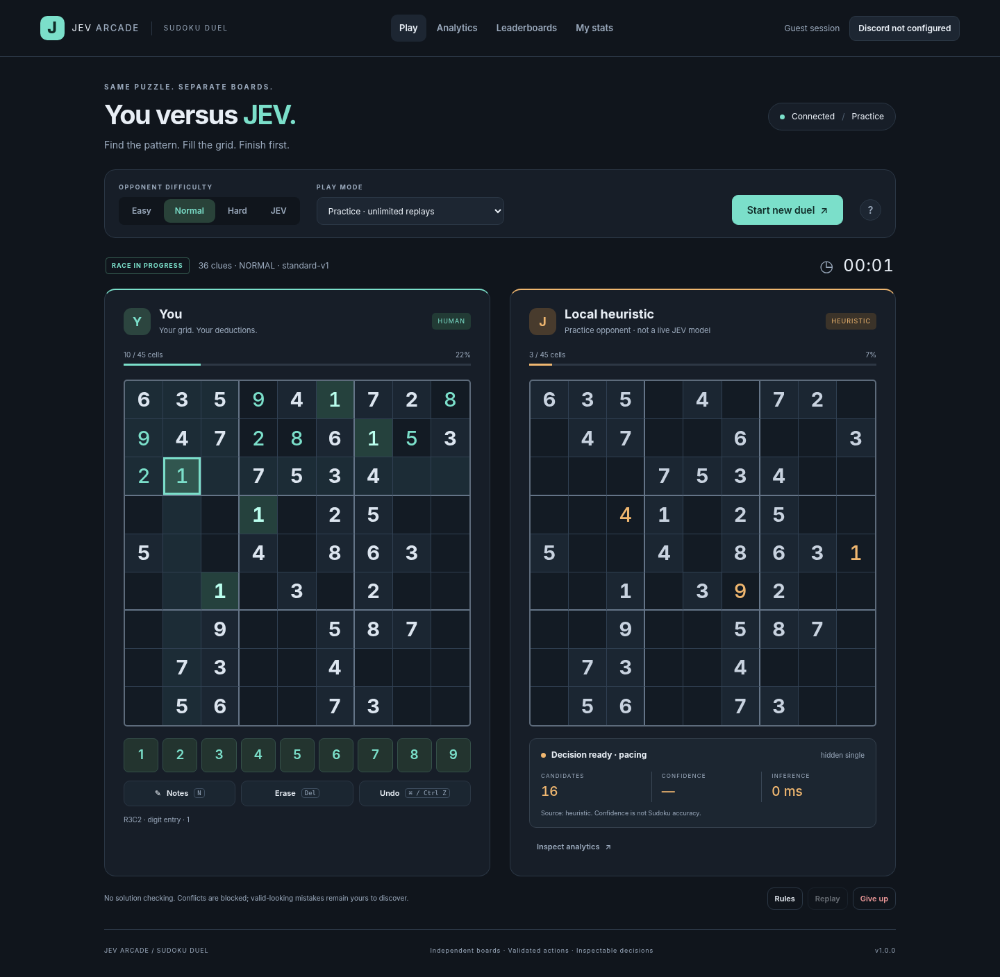
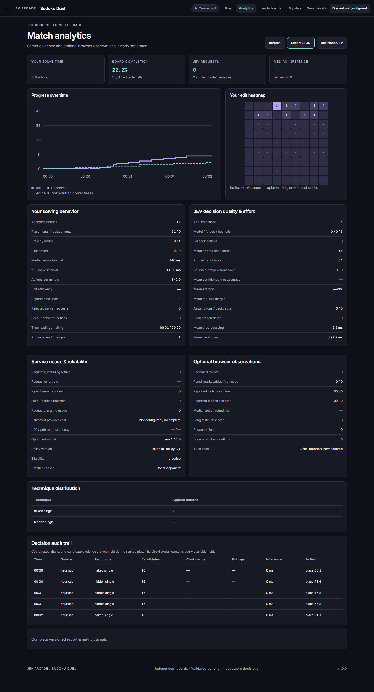

# JEV Arcade — Sudoku Duel

**You and JEV solve the same Sudoku on separate boards.** A single-page, framework-free game with a server-owned race clock, hash-chained authoritative match records, Discord community leaderboards, and a detailed analytics workbench. It runs as one **Cloudflare Worker with D1** (free plan, no containers) at **https://sudoku.jevplay.games**.

This repository contains **working application source**, automated tests, the Cloudflare deployment configuration, benchmarks, screenshots and metric definitions. It does not contain credentials, a populated player database or the ranked daily puzzles.



## Start locally

Node **22.16 or newer** is required (built-in `node:sqlite` and `node --test`; Node prints an experimental SQLite warning).

```bash
cp .env.example .env      # optional
npm start
```

Open **http://localhost:3000**. No `npm install`, Python, API key, database server or build step is needed to play. `npm start` runs the exact Worker Cloudflare runs behind a small Node adapter (`local/server.js`) with `node:sqlite` standing in for D1.

Without a TypeSafe key, the opponent is prominently labeled **Local heuristic**, and every game is practice. It is not represented as live JEV. Guest progress and history belong to the current session.

## What is included

| Area | Implemented functionality |
|---|---|
| Game | Two independent 9×9 boards, unique-solution puzzles, simultaneous solving, notes, erase, undo, keyboard/touch controls, responsive layout, rules dialog, timed outcomes. |
| Opponent | Easy / Normal / Hard / JEV technique profiles; bounded, structured TypeSafe Choice requests; proof-validated actions; explicit branching; visible decision evidence; honest fallback. |
| Trust | Server-issued puzzle, server clock, ownership checks, compare-and-swap event log with a hash chain, per-append validation, verified results, one official attempt per daily challenge. |
| Community | Discord OAuth with `identify`, signed user-bound channel launches, Discord Activity mode, Channel / Server / World rankings, equal ranks for equal second buckets. |
| Analytics | Solving cadence, edit heatmaps, progress leads, candidate and technique metrics, confidence/entropy, inference/preprocessing/pacing distributions, usage/cost completeness, optional browser telemetry, personal history, operator funnels/activity/retention, exports. |
| Operations | Cloudflare Workers + D1, lazy bounded maintenance (no cron), D1-reserved provider quotas, privacy controls, JSON operational events. |

### Race rules

Complete all rows, columns, and 3×3 boxes with digits 1–9. Starting clues are immutable. Immediate row/column/box conflicts are blocked, but locally legal incorrect guesses remain editable; there is no answer-key feedback.

The first correct completion wins. Completions in the same elapsed one-second bucket tie. When JEV finishes first, you may continue for a verified completion time. A forfeit loses the race. Neither side finishing within 60 minutes produces a timeout draw. Expired reservations and attempts abandoned for ten minutes are **void**, not counted as competitive wins, losses, or draws.

Opponent strength changes techniques and decision budgets, not random mistakes. Ranked action pacing has an eight-second minimum. Opponent difficulty is not a certified puzzle difficulty rating.

There is no server process to keep the opponent moving between requests, so the browser polls once a second while a race runs and every poll lets the server apply any opponent step that has become due. Opponent moves are stamped with their scheduled time. See [docs/WORKERS.md](docs/WORKERS.md).

## Analytics

Open **Analytics** during or after a game. It provides a progress step chart, 81-cell edit heatmap, solving/decision/reliability panels, a technique table, a decision audit, and a complete versioned JSON report.



Reports separate **authoritative server observations** from **optional, forgeable browser observations**. Browser collection is off by default. A confidence value is not calibrated Sudoku accuracy; filled cells are not proof of correctness. Unknown cost and empty denominators are `null`, not invented zeroes.

Use **My stats & privacy** to opt in, remove optional observations, export account data, inspect a replay, or delete stored games/results. Operator analytics require an allowlisted Discord identity or a server-only API bearer token.

The complete field dictionary, formulas, trust labels, retention semantics, and export examples are in **[docs/ANALYTICS.md](docs/ANALYTICS.md)**.

## Enable real JEV and ranked play

1. Set `TYPESAFE_API_KEY` (`.env` locally, a Wrangler secret on Cloudflare). The Worker calls the TypeSafe API; credentials never go to the browser. The default model is `jev-1.13.0`.
2. Configure the Discord application credentials and callbacks described in [Deployment](docs/DEPLOYMENT.md).
3. Publish daily puzzles out of band (they are secret until played): `npm run puzzles -- --days 7` locally, or `--sql` to produce a file for `wrangler d1 execute`.
4. Sign in with Discord. A signed `/jev sudoku` launch supplies server/channel attribution; direct sign-in supports World results only.

A service fallback, quota exhaustion or answer reveal makes the attempt practice **before** answers/fallback actions are released. The daily attempt stays consumed. A configured key is not proof of healthy external access; verify an actual game with your credentials before opening ranked play publicly.

## Commands

```bash
npm start                                    # local Worker adapter, .data/sudoku.sqlite
npm test                                     # rules, API, auth, scheduling, budgets, analytics, runtime
npm run bench:requests                       # CPU + D1-query benchmark of the hot request paths
npm run benchmark -- --puzzles 2             # offline selector comparison; no paid calls
npm run puzzles -- --days 7                  # ranked daily puzzles into the local database
npm run puzzles -- --days 7 --sql .data/challenges.sql   # ...or as SQL for D1
npm run analytics -- --days 30 --out reports/operator.json
npm run maintenance -- --integrity           # local database file only
npm run deploy                               # wrangler deploy
npm run db:remote                            # wrangler d1 migrations apply jev-sudoku --remote
npm run discord:register                     # (re)register /jev sudoku
```

The optional browser smoke test needs Python, Playwright, and Chromium, but these are **not application dependencies**:

```bash
python -m pip install -r requirements-dev.txt
python -m playwright install chromium
npm run test:browser
```

A paid live-model benchmark requires both a configured key and an explicit opt-in:

```bash
npm run benchmark -- --live --selectors jev --puzzles 2 --split holdout
```

Review the number of puzzles, profiles, and maximum actions before running it. The benchmark is not capped by the web match request budget.

## Package guide

- [Deployment](docs/DEPLOYMENT.md): Cloudflare setup, secrets, D1, DNS, Discord, operations, free-plan limits, local development.
- [Workers design](docs/WORKERS.md): how the match lifecycle works without timers, voiding semantics, integrity, CPU and query measurements, remaining risks.
- [Architecture and API](docs/ARCHITECTURE.md): boundaries, decisions, schemas, diagrams, endpoint contracts.
- [Analytics dictionary](docs/ANALYTICS.md): metrics, distributions, costs, privacy, reports, interpretation.
- [Discord Activity](docs/ACTIVITY.md): running the game inside Discord.
- [Security and limitations](docs/SECURITY.md): threat coverage and remaining risks.
- [Testing and release evidence](docs/TESTING.md): exact checks and untested boundaries.
- [Source references](docs/SOURCES.md): official documentation used for integration contracts.
- `docs/source-prompt.md`: supplied architectural brief, preserved as source material.
- `reports/workers/`: regenerated evidence for the Cloudflare build (request CPU benchmark, tests, browser and maintenance smoke). `reports/*` outside that folder is the original container-era evidence, kept as history.

## Release boundaries

This is a runnable implementation, **not a claim of production certification**. No live Discord account or paid JEV key was available during assembly, and the Worker has not been deployed to Cloudflare from this repository yet. External flows were tested with mocks and cryptographic fixtures. The included benchmark measures local selectors, not actual JEV strength.

CPU figures were measured on Node/V8, not on the Workers runtime; cold `jev`-profile opponent steps sit within a few milliseconds of the 10 ms free-plan limit ([docs/WORKERS.md](docs/WORKERS.md)). Deployed browser networking, CSP enforcement and HTTPS on the real origin still need an ordinary staging check.

Server verification cannot detect all external solvers, multi-account abuse, solution sharing, or modified clients. It verifies recorded rules and outcomes, not unaided human play. Larger-scale load testing, accessibility audits with assistive technology, independent security review, and live-model calibration remain deployment tasks.
