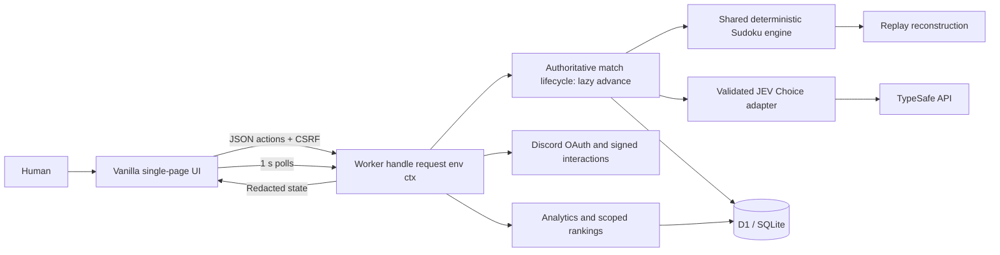
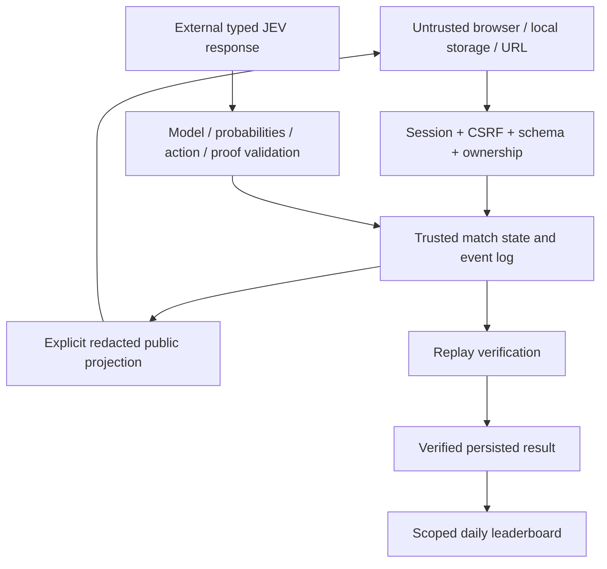
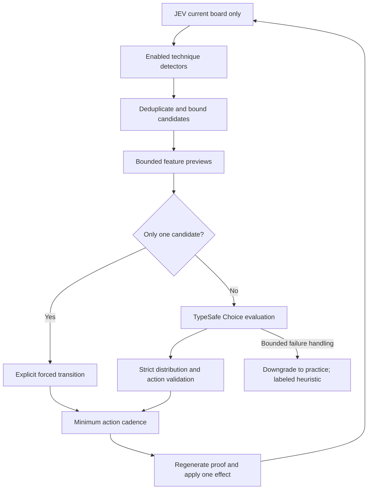
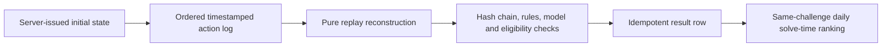

# Architecture and API

This document describes the shipped code, rather than an aspirational later platform. The original planning brief is preserved separately in `source-prompt.md`. The game runs as a Cloudflare Worker with D1; [WORKERS.md](WORKERS.md) explains how the match lifecycle works without timers or a long-lived process, and records the CPU and query measurements.

## Runtime and trust



The browser renders from data rather than reading board state back from the DOM. It performs immediate local legality checks but never sets official timestamps, scores, opponent decisions or community identities. The server owns independent human/JEV arrays, ordered events, candidate validation and eligibility.



There is no generic score-submission API, public arbitrary model proxy, query-parameter guild override, or hidden development login.

## Rules and state

`public/shared/sudoku.js` defines 81-cell row-major boards, all 27 units, candidate masks, immutable clues, human transitions, consistency and completion. The exact uniqueness solver is used for puzzle generation and testing, not to supply JEV's answers.

`public/shared/match.js` adds phase, elapsed milliseconds, sequential revisions, outcome, configuration and eligibility. Human state owns values/undo/revision/finish. JEV state separately owns values/eliminations/branches/revision/status/last action time.

Events include `start`, `human`, `jev`, `jev_stalled`, `eligibility`, `settle`, `timeout`, and `void`. Functions receive timestamps; the pure engine does not read wall clocks or the DOM. A pending reservation expires after five minutes or at its daily challenge boundary. Expiration releases capacity without providing another official attempt for the same challenge. A running attempt that its owner has not touched for `ABANDONED_AFTER_MS` is voided. Opponent events are stamped with their scheduled time, and the events are applied lazily when a request touches the match ([WORKERS.md](WORKERS.md)).

`ready → running → settling → finished` is the normal human-first path. A JEV finish leaves the human running. Same-second completions tie. The server closes the human finish bucket before applying a later opponent step. A profile without a deduction becomes stalled rather than inventing a move.

## JEV decision path



| Profile | Techniques | Maximum candidates | Preview transition budget |
|---|---|---:|---:|
| Easy | Naked singles | 8 | 0 |
| Normal | Easy + hidden singles, locked candidates | 16 | 32 |
| Hard | Normal + naked/hidden pairs, X-Wing | 32 | 256 |
| JEV | Hard + naked triples, explicit assumption/backtracking | 64 | 2,048 |

Each candidate is one certified placement/elimination or explicit search transition. Preview work uses temporary state and does not automatically play its derived moves. MRV assumptions retain alternatives, restore branch snapshots on contradiction, and rule out the failed assumption.

`server/jev.js` sends one `next_action` Choice question to the pinned model. Inputs include JEV's values, givens, explicit candidates and features—not human entries, identity, a saved solution or the private generator seed. The output must match the model, question, candidate membership, numeric ranges and probability mass. The selected action is validated again against current revision/proof.

Deterministic replay uses recorded selections; an external service is not assumed repeatable. API timeout/retry handling is bounded. Failed selection switches to practice with `heuristic_fallback`; all subsequent use remains explicit. Forced steps are recorded separately and do not make an outbound call.

## Identity and community

```mermaid
sequenceDiagram
    participant B as Browser
    participant S as Server
    participant D as Discord
    B->>S: OAuth start
    S->>S: One-use state bound to session
    S-->>B: Authorization redirect (identify)
    B->>D: Approve
    D-->>B: Callback with code/state
    B->>S: Callback
    S->>D: Server-side code exchange and current user
    S->>S: Validate state; rotate session; discard tokens
    S-->>B: HttpOnly cookie and clean redirect
```

Authentication establishes a Discord user. Separately, a signature-verified `/jev sudoku` interaction establishes invocation in a guild/channel. A ten-minute signed launch token is bound to that user and a one-use nonce. The token is delivered in a URL fragment to avoid ordinary query logging. Redemption after login must match the subject; resulting context expires after one hour and is copied into a new match. This proves invocation-time context, not permanent channel membership.

World results require Discord and an official challenge, but not a community launch. Server/channel queries require fresh server-held context. Raw IDs supplied by a browser are never authorization.

## API contracts

Browser mutations use `application/json`, a same-origin `Origin`, the HttpOnly session cookie, and `X-CSRF-Token` from `/api/me`. Discord's interaction endpoint instead requires the signed raw-body protocol. Operator bearer authorization only applies to the read-only operator route.

| Route | Contract |
|---|---|
| `GET /api/health` | Liveness; no secrets. |
| `GET /api/me` | Issue/resume guest session; return identity, CSRF, capabilities, context, active match and consent. |
| `GET /api/auth/discord` | Begin authorization-code OAuth. |
| `GET /api/auth/discord/callback` | Validate state, exchange code, fetch identity, rotate session. |
| `POST /api/logout` | Revoke current session. |
| `POST /api/discord/interactions` | Signature-verified ping or `/jev sudoku`; ephemeral personal launch link. |
| `POST /api/context` | `{launch}`; redeem signed user-bound context once. |
| `POST /api/matches` | `{requestId,difficulty,mode}`; reserve server-selected puzzle. Givens are withheld until start. |
| `POST /api/matches/:id/start` | `{}`; start owner match and return first board snapshot. |
| `POST /api/matches/:id/actions` | `{requestId,expectedHumanRevision,action}`; validate and record owner edit. |
| `GET /api/matches/:id` | Owner-only public snapshot. This is the poll: it also applies any opponent step that has become due (bounded per request). |
| `GET /api/matches/:id/events` | Removed: `410 events_removed_use_polling`. |
| `POST /api/matches/:id/reveal` | `{}`; irreversible practice downgrade before revealing answers. |
| `GET /api/matches/:id/analytics` | Owner authorized report; optional `format=csv`; `evidence=omit` drops per-decision candidate evidence; full evidence above 350 KB is `413 evidence_too_large` (use the replay); live ranked redaction. |
| `GET /api/matches/:id/replay` | Owner-only completed replay, served as the stored events verbatim. |
| `POST /api/matches/:id/telemetry` | `{events:[{id,name,properties}]}`; opt-in required; max50 bounded observations per batch. |
| `GET /api/leaderboard` | `scope,date,difficulty,limit,cursor`; World public, community scope authorized. |
| `GET /api/analytics/me` | Most recent200 owned matches with coverage-labeled aggregates. |
| `GET /api/analytics/operator` | Authorized aggregate; `days`1–365 and optional difficulty; cached five minutes (`fresh=1` bypasses). |
| `POST /api/privacy` | `{telemetryConsent:boolean}`; disabling deletes owned optional observations; reports rebuild from what remains when read. |
| `GET /api/me/export` | Owned state, authorized analytics, completed replays; no keys or live hidden answers. Paged: `offset`, `limit`; follow `nextOffset`. |
| `DELETE /api/me/data` | `{confirm:"DELETE MY DATA"}`; delete owned records; bounded keyed attempt marker exception. |

Human actions are `{kind:"set",cell,digit}`, `{kind:"clear",cell}`, `{kind:"undo"}`, or `{kind:"forfeit"}`. The server derives undo data. Unknown action/request keys are rejected; user-supplied score/time fields are not accepted. Duplicate request IDs are idempotent. Human revision changes are independent of opponent revision changes.

Typical errors: 400 malformed JSON, 401 session/login required, 403 ownership/CSRF/context, 409 stale revision/attempt conflict, 413 body too large, 415 content type, 422 invalid input, 429 limits, 503 unavailable capacity/provider configuration. `409 opponent_syncing` means an opponent step that was already due has not been applied yet; retry the same request id.

## Persistence and result verification

`migrations/*.sql` is the versioned schema (applied by `wrangler d1 migrations apply` on Cloudflare and on open by the local adapter). Tables: users, sessions, security_tokens, challenges, puzzle_pool, matches, match_events, pending_decisions, results, telemetry, operations, quotas, meta and report_cache. IDs that originate from Discord remain strings.

Each event append is one atomic D1 batch guarded by `matches.revision` (compare-and-swap): the event row, the state snapshot, its hashes and the hash chain move together. Result finalization re-checks the state hash, event count and (for ranked) the decision sources, then inserts an idempotent result whose replay hash is the event-chain head. A finished match whose result write failed is retried by the lazy sweep. Active matches nobody touches are voided rather than claiming uninterrupted timing. There is no replay re-simulation inside a request; see [WORKERS.md](WORKERS.md) for why per-append verification replaces it and how to run the full independent replay.



Leaderboard rank is based on the human completion's elapsed one-second bucket, independent of whether JEV won. Ties share `RANK()` values. Comparisons are always within the same daily challenge/profile. Pagination has a bounded limit and filter-bound cursor; membership/context is independently rechecked on every request.

## Files and dependencies

- `public/`: semantic HTML, CSS, game controller and analytics renderer; no framework or build step. `public/shared/` holds the pure code (mechanics, technique policy, match transitions, replay, metric derivation) imported by both the browser and the Worker.
- `server/`: `worker.js` (routing, headers), `matches.js` (lifecycle, lazy advance, leases, verification), `jev.js` (provider adapter), `auth.js`/`security.js` (Discord, sessions, CSRF), `reports.js`, `maintenance.js`, `puzzles.js`, `db.js` (D1 helpers, quota reservations), `config.js`. Web APIs only.
- `local/`: the Node adapter (`server.js`) and the node:sqlite-backed D1-compatible `database.js`.
- `migrations/`: D1 schema and the practice puzzle pool.
- `scripts/`: puzzle publishing, pool/golden generation, benchmarks, command registration, reports and local-database maintenance.
- `tests/`: dependency-free Node tests over real SQLite. Browser smoke uses optional Python Playwright.
- `wrangler.jsonc`: the Cloudflare deployment.

The Worker uses no Node built-ins and there are zero npm dependencies. Modules are shared where reuse is immediate; no generalized multi-game plugin platform is invented.

## Deliberate release choices

Offline continuation operates only after loading the application and creates a separate, explicitly unranked local copy. It is not an installable offline PWA. Its heuristic opponent restarts from the givens. Restored server attempts are downgraded before any official continuation.

Prepared unique daily puzzles are not overwritten. Advanced logical techniques exist, but the two-family smoke benchmark does not calibrate human difficulty or establish which profile is faster. Stronger techniques can consume more paced elementary actions.

Public replay hosting, cross-puzzle Elo, billing integration, background schedulers, bot Gateway connections, ad tracking, push notifications and cross-game orchestration are intentionally absent.
